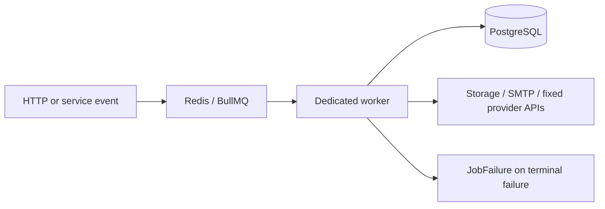

# Background jobs

Redis transports BullMQ jobs; PostgreSQL remains the source of truth. Queue payloads contain identifiers or minimal normalized events, retries use exponential backoff, and terminal failures are recorded in `JobFailure` without secrets.

| Queue | Responsibilities | Retry/idempotency boundary |
| --- | --- | --- |
| `email` | Non-auth transactional mail | tracked delivery records; five attempts |
| `analytics` | Privacy-conscious events and daily aggregates | daily visitor hash and aggregate upserts |
| `billing` | Durable webhook transitions and publication-entitlement refresh | unique provider event IDs and deterministic job IDs |
| `media` | FFprobe validation, H.264 loop, WebP poster, storage writes | asset status and generated derivative keys |
| `integration` | GitHub, Spotify, YouTube, and Twitch refreshes | one job per block/minute; fresh and 24-hour stale caches |
| `maintenance` | Delayed deletion/anonymization | deletion state machine |

Public widget requests validate that the block exists in the active published snapshot. They return fresh cache data immediately; on a miss they enqueue an idempotent refresh and return either last-known data marked `STALE` or an unavailable payload. External provider calls therefore do not block public rendering. Provider adapters accept identifiers only, use fixed HTTPS hosts, timeouts, response-size bounds, and strict response schemas.

The Docker worker image installs FFmpeg/FFprobe and runs as the non-root `nextjs` user. Host development requires compatible binaries configured through `FFMPEG_PATH` and `FFPROBE_PATH`.
