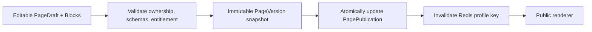
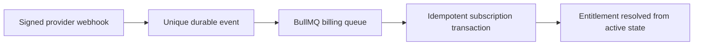
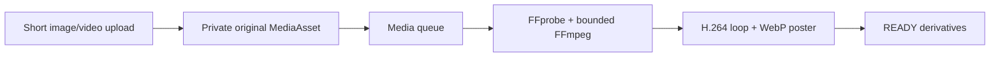
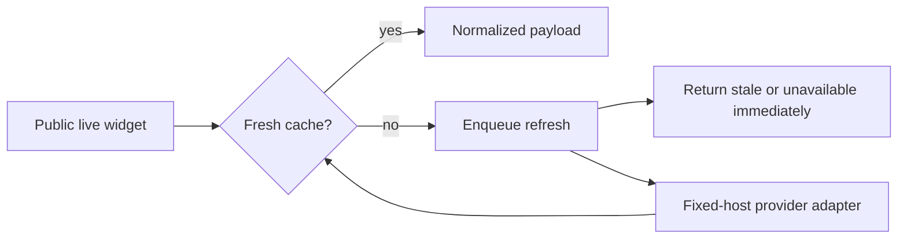
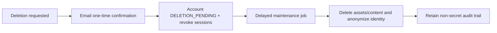

# Core flows

```mermaid
sequenceDiagram
  participant U as User
  participant A as Auth.js
  participant D as PostgreSQL
  participant M as SMTP
  U->>A: submit email
  A->>D: store hashed expiring token
  A->>M: send single-use link
  U->>A: open callback link
  A->>D: consume token; create/load user and DB session
```





Analytics uses `browser beacon -> rate-limited route -> BullMQ -> event + daily aggregate`. Non-auth mail is queue-suitable; authentication mail remains synchronous, tracked, and observable so Auth.js can report delivery failures.






