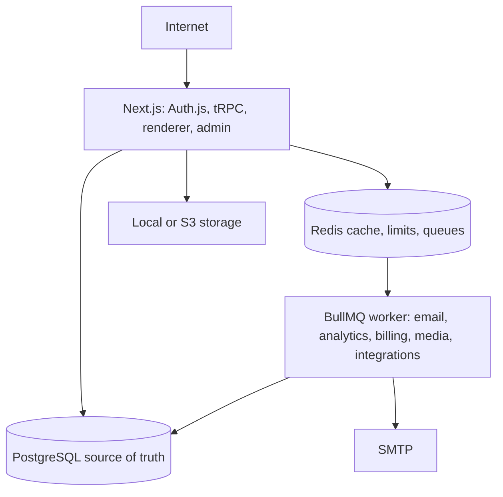

# System overview

The application is a modular monolith. Routers validate transport inputs; focused services own transactions and business rules; Prisma owns relational persistence. Queue payloads are identifiers or normalized minimal events. Public profile reads resolve a normalized username to a single active `PageVersion.snapshot` and validate its schema before rendering.

Major model groups are identity (`User`, `Account`, `Session`, `VerificationToken`), public identity (`Profile`, `UsernameHistory`), content (`Page`, `PageDraft`, `Block`, `Theme`), publishing (`PageVersion`, `PagePublication`), SaaS (`Plan`, `Feature`, `PlanEntitlement`, `Subscription`, `UsageCounter`), platform services (`MediaAsset`, `IntegrationConnection`, `PollVote`, analytics, mail delivery), and trust (`AuditLog`, `SecurityEvent`, reports/moderation, deletion).
