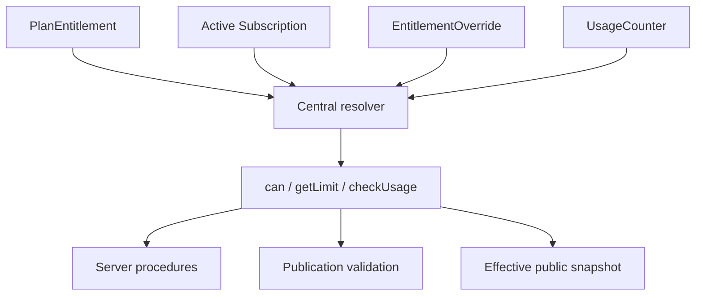

# Premium and entitlement flow

Plans and feature grants are relational data. UI badges explain availability, but `EntitlementService`, publication validation, upload limits, and protected procedures remain the enforcement points. Feature flags control rollout separately and never grant paid capabilities.

Theme feature mapping includes video backgrounds, premium glass/palettes, premium fonts, advanced animation/effect choices, and branding removal. Live provider blocks require `LIVE_INTEGRATIONS`. Free choices—solid and regular gradients, animated gradient shift, broad font selection, multiple button shapes/styles, profile rings, stars, and snow—remain fully usable.

The development provider produces signed webhooks that enter the same durable event pipeline as future payment adapters. External browser state is never trusted. Admin offline/IBAN grants use provider `manual`, add 1–24 UTC calendar months from `max(now, currentPeriodEnd)`, and run in a serializable transaction with conflict retries. Each grant creates a `SubscriptionEvent` and `SUBSCRIPTION_MANUAL_GRANT` audit entry without altering unrelated provider subscriptions.

Every activating or expiring transition enqueues `refresh-publication-entitlements:{userId}:{marker}`. The job is idempotent, rebuilds active effective snapshots from the preserved source snapshot, and invalidates profile/widget caches.
