# Publication flow

The editor owns an immediate local document and debounces validated saves into `PageDraft`, `Block`, and versioned theme JSON. Saving never changes the public page. Every configuration object has a schema version and is parsed with Zod when loaded, edited, and published.

```mermaid
flowchart LR
  E[Local editor state] -->|750 ms autosave| D[PageDraft + Blocks]
  D --> O[Ownership and schema validation]
  O --> A[Asset readiness and ownership]
  A --> P[Entitlement validation]
  P --> N[Normalized snapshot]
  N --> V[Immutable PageVersion]
  V --> X[Atomic active PagePublication]
  X --> C[Invalidate profile and widget caches]
  C --> R[Public renderer]
```

`PagePublication` points to exactly one active immutable version. The public route normalizes the username, resolves the cached effective snapshot, verifies account/profile status, and renders without joining editor tables. Rollback architecture is retained because prior `PageVersion` rows are immutable.

Blocks removed from a draft are tombstoned instead of immediately destroyed. Editor and future publish queries exclude tombstones, while interactive blocks in the active snapshot can continue resolving votes or live data until a new version replaces that publication. This preserves the draft/public isolation guarantee without retaining deleted blocks in new snapshots.

Premium configuration is never erased. Publication first creates the creator's full snapshot; `buildEffectivePublicationSnapshot` then removes or downgrades capabilities that are no longer entitled for public delivery. Subscription transitions enqueue the same effective-snapshot regeneration, so an expired video background becomes inactive while remaining in the draft for later restoration.

Background and avatar fields persist owned `MediaAsset` IDs, never arbitrary storage URLs. Publishing requires referenced assets to be ready and owned by the profile owner. The effective public snapshot contains resolved, sanitized delivery URLs only where needed by the renderer.
